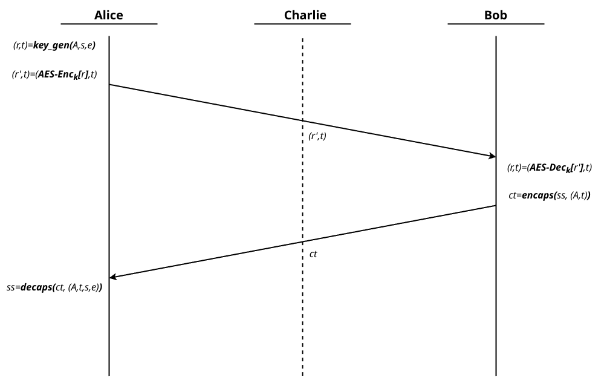

# The Kyber Asymmetric Password-based Peer Authentication (KAPPA) Protocol

**Revision 1.2 (special draft), 2-16-2025**\
**Authored by Vibhav Tiwari**

> [!CAUTION]
>  This protocol and all its derivatives are still under development and not recommended for use in a production environment or for securing sensitive data. Additionally, please be aware that the protocol and this document are subject to change.
>
>  If you have any relevant concerns or feedback for the developers, please [contact us via email]().

---

## Table Of Contents

- [The Kyber Asymmetric Password-based Peer Authentication (KAPPA) Protocol](#the-kyber-asymmetric-password-based-peer-authentication-kappa-protocol)
  - [Table Of Contents](#table-of-contents)
  - [1. Introduction](#1-introduction)
  - [2. Preliminaries](#2-preliminaries)
    - [2.1. KAPPA parameters](#21-kappa-parameters)
    - [2.2. Cryptographic notations](#22-cryptographic-notations)
    - [2.3. Roles](#23-roles)
    - [2.4 Named key pairs](#24-named-key-pairs)
  - [3. The Module-LWE problem](#3-the-module-lwe-problem)
    - [3.1. Overview](#31-overview)
      - [3.1.1. Definition](#311-definition)
      - [3.1.2. Hardness assumption](#312-hardness-assumption)
    - [3.2. Kyber KEM](#32-kyber-kem)
    - [3.3. The Decisional MLWE game](#33-the-decisional-mlwe-game)
    - [3.4. Decisional MLWE instance in Kyber](#34-decisional-mlwe-instance-in-kyber)
  - [4. Authentication using a pre-shared password](#4-authentication-using-a-pre-shared-password)
    - [4.1. Theoretical model](#41-theoretical-model)
    - [4.2. Practical implementation](#42-practical-implementation)
    - [4.3. Protection from offline brute-force attacks](#43-protection-from-offline-brute-force-attacks)
  - [5. The KAPPA four-way handshake](#5-the-kappa-four-way-handshake)
    - [5.1. Initiation](#51-initiation)
    - [5.2. Response](#52-response)
    - [5.3. Completion](#53-completion)
    - [5.4. Key derivation](#54-key-derivation)
    - [5.5. Verification initiation](#55-verification-initiation)
    - [5.6. Verification completion](#56-verification-completion)
  - [6. Authentication levels](#6-authentication-levels)
  - [7. Security considerations](#7-security-considerations)
    - [7.1. Offline brute-force dictionary attacks](#71-offline-brute-force-dictionary-attacks)
    - [7.2 Denial-of-Service](#72-denial-of-service)
    - [7.3. Forward secrecy](#73-forward-secrecy)
    - [7.4. Forced session key reuse attack](#74-forced-session-key-reuse-attack)
    - [7.5. Passive quantum adversaries](#75-passive-quantum-adversaries)
    - [7.6. Active quantum adversaries](#76-active-quantum-adversaries)
    - [7.7. KEM re-encapsulation attack](#77-kem-re-encapsulation-attack)
    - [7.8. Risks of weak random sources](#78-risks-of-weak-random-sources)
  - [8. Acknowledgments](#8-acknowledgments)
  - [9. References](#9-references)

---

## 1. Introduction

The KAPPA protocol is a four-way handshake that provides password-based authentication and session key establishment between two peers. This protocol relies on the two parties having knowledge of a shared password established securely out-of-band. The handshake involves two roles, an "initiator" and a "responder". The initiator delivers the initial message to the responder which begins the handshake.

Every ZeroTunnel transfer starts with this handshake. By the end of the handshake, both parties derive a new session key, which is used solely for the current transfer. After the transfer is complete, all keying material is destroyed, and the entire handshake is performed again, even if the same parties start another transfer in the future.

The rest of this document discusses the details of the KAPPA protocol and its security considerations.

## 2. Preliminaries

### 2.1. KAPPA parameters

An application using KAPPA must decide on several parameters:

| Name       | Definition                                                                                                                                    |
| ---------- | --------------------------------------------------------------------------------------------------------------------------------------------- |
| _Password_ | The shared master password for authentication, established out-of-band                                                                        |
| _PQ-KEM_   | A post-quantum key encapsulation mechanism with IND-CCA2 security based on the hardness of the Module-LWE problem (e.g. Kyber)                |
| _DHE_      | An Ephemeral Elliptic-Curve Diffie-Hellman key exchange algorithm (e.g. X25519 or X448)                                                       |
| _Cipher_   | A symmetric key block cipher encryption algorithm without implicit authentication (e.g. AES-CTR or ChaCha20)                                  |
| _AEAD_     | An Authenticated Encryption and Associated Data symmetric key encryption algorithm (e.g. AES-GCM or ChaCha20-Poly1305)                        |
| _KDF_      | A memory-hard key derivation function with resistance against offline brute-force attacks (e.g. Scrypt or Argon2)                             |
| _HMAC_     | A hash-based keyed Message Authentication Code (e.g. HMAC-SHA256 or HMAC-SHA512)                                                              |
| _Settings_ | An ASCII string containing the handshake parameters or one of multiple cipher suites with pre-configured combinations of the above parameters |

### 2.2. Cryptographic notations

Throughout the document, all public keys have a corresponding private key, but to simplify descriptions we will identify key pairs using the public key and assume the owner has access to the corresponding private keys.

The following notation is used in this document:

- _**(CT, SS) = PQKEM-Enc(PQPK)**_ represents a tuple of byte sequences that are the PQ-KEM ciphertext CT, produced as an output upon encapsulating the shared secret SS using the public key share PQPK.

- _**PQKEM-Dec(CT, PQPK)**_ represents the shared secret byte sequence decapsulated from the ciphertext CT using the private key represented by the public key PQPK, originally encapsulated using PQPK with the PQ-KEM algorithm.

- _**DHE(PK1, PK2)**_ represents a byte sequence which is the output from an ephemeral Elliptic-Curve Diffie Hellman operation involving the key pairs represented by the public keys PK1 and PK2. Since we are using ephemeral DH, the key pairs are randomly generated for each session and destroyed when the session ends.

- _**HMAC(input, KM)**_ represents the byte sequence that is the digest output of a keyed hash-based MAC algorithm over an input byte sequence and with the following key material:

  - HMAC key = the key bytes with length equal to the output length of the HMAC algorithm, produced from a key derivation function.
  - Salt = a randomly generated high-entropy byte string attached along with the HMAC output.

- _**KDF(KM, N)**_ represents N bytes of output from a memory-hard [[6]](#9-references) key derivation function with the following input key material:

  - KDF Key = a low-entropy ASCII password or raw key bytes.
  - KDF salt = a randomly generated salt attached to the KDF output.
  - KDF constant = an ASCII string distinct for each stage where this KDF is used.

- _**Cipher-Enc(PT, K, iv)**_ represents a byte sequence that is the output of an encryption operation on the plaintext byte sequence PT using the block cipher encryption algorithm with key K and a random initialization vector.

- _**Cipher-Dec(CT, K, iv)**_ represents the byte sequence from decrypting the ciphertext byte sequence CT using the block cipher encryption algorithm with key K and a random iv.

- _**(CT, tag) = AEAD-Enc(PT, AAD, K, iv)**_ represents a tuple of byte sequences that are ciphertext CT and an authentication tag from the AEAD encryption of the plaintext byte sequence PT along with additional authenticated data AAD, using key K and a random initialization vector.

- _**AEAD-Dec(CT, AAD, tag, K, iv)**_ represents the byte sequence from an AEAD decryption of ciphertext CT with key K and IV. If the tag calculated during decryption does not match the tag received from the encryption, the operation fails.

- _**(data1 || data2)**_ represents a byte sequence that is the concatenation of two byte sequences or bitstrings data1 and data2.

- _**len(data)**_ is the length of data in bytes, represented as an unsigned integer.

- _**data[a:b]**_ represents the byte sequence that is the 'substring' of the byte sequence data, spanning indices a through b-1. Thus, len(data[a:b]) = b-a.

### 2.3. Roles

The KAPPA handshake involves two parties: an **initiator**, say, **Alice** and a **responder**, say, **Bob** who have established a password in advance that they will use to authenticate each other. More specifically,

- **Alice** wants to send **Bob** some initial encrypted payload while also establishing a shared key which may be used for bidirectional encrypted communication. **Alice** wants to ensure she only sends data to **Bob** if he has the shared password (without ever revealing the password) that the pair established out-of-band before the handshake began.

- **Bob** wants to allow parties like **Alice** to send him encrypted data only if **Alice** knows the password, and must also prove to **Alice** that he knows the password.

There may be a **Server** involved in relaying data between **Alice** and **Bob** but this is solely to enable application-level features like peer discovery and communication across NATs. Such a **Server** has no participation in the handshake. The handshake enforces cryptographic techniques that make it extremely difficult for any third party who does not know the password (such as a relay server) to compromise the security of the communication. However, if such an interfering third party is able to alter data from the sender in transit and relay it to the recipient, such an effort will cause a handshake failure between **Alice** and **Bob** causing a Denial-Of-Service.

### 2.4 Named key pairs

For the rest of this document, Alice (subscript A) and Bob (subscript B) will refer to the initiator and responder roles respectively in order to keep the notations and descriptions concise.

| Name      | Description                                          |
| --------- | ---------------------------------------------------- |
| _OTPQK_   | Alice's post-quantum one-time PQ-KEM key             |
| _DHEKA_ | Alice's ephemeral Elliptic Curve Diffie-Hellman key  |
| _DHEKB_ | Bob's ephemeral Elliptic Curve Diffie-Hellman key    |

## 3. The Module-LWE problem

This section briefly explains the Module Learning-with-Errors (Module-LWE) problem, which serves as the foundation for the post-quantum cryptographic (PQC) scheme Kyber. The security of Kyber, and consequently this authentication scheme, relies on the hardness of solving Module-LWE.

### 3.1. Overview

The Module-LWE problem generalizes the standard Learning-with-Errors (LWE) problem by replacing scalars with polynomials over a quotient ring.

#### 3.1.1. Definition

1. Choose a prime $q$ and a power of two $n$. Define the polynomial quotient ring:

  $$R_q = \mathbb{Z}_q[x] / (x^n + 1)$$

  This ring consists of polynomials with coefficients in $\mathbb{Z}_q$, reduced modulo $x^n + 1$.

2. Sample a uniformly random matrix $A \in R_q^{k \times k}$, a secret vector $s \in R_q^k$, and an error vector $e \in R_q^k$, where elements of $s$ and $e$ are small polynomials drawn from a centered binomial distribution $\beta_\eta$.

3. Compute:

 $$t = A \cdot s + e$$

 The challenge is to distinguish the pair $(A, t)$ from a uniformly random pair $(A, t') \in R_q^{k \times k} \times R_q^k$. This problem is assumed to be hard under worst-case lattice assumptions, even on quantum computers.

#### 3.1.2. Hardness assumption

If the error vector $e$ were absent, solving for $s$ would be trivial using Gaussian elimination. However, the presence of the small error makes the problem as hard as certain lattice problems, which are believed to be resistant to brute-force attacks on a quantum computer.

### 3.2. Kyber KEM

Kyber (formally KEM CRYSTALS-KYBER) [[1]](#9-references) is a lattice-based Key Encapsulation Mechanism (KEM) based on the Module Learning-with-Errors (Module-LWE) problem. It operates over the ring $R_q = \mathbb{Z}_q[x] / (x^n + 1)$, where polynomials with small coefficients are used as the secret and error terms. The security of Kyber relies on the hardness of solving Module-LWE.

Kyber has three main operations that we are concerned with. From an abstract view, they can be defined as follows:

- $(A,t)=key \textunderscore gen(A,s,e)$ represents the key generation function which outputs a public key $(A,t)$ from a random matrix $A$, random secret vector $s$ and a random secret error term $e$

- $ct=encaps(ss, (A, t))$ represents the encapsulation of a shared secret $ss$ with the public key $(A,t)$ which outputs ciphertext $ct$

- $ss=decaps(ct, (A, t,s,e))$ represents the decapsulation of ciphertext $ct$ using the private key $(A,t,s,e)$ counterpart of the public key $(A,t)$ which yields back the shared secret $ss$

### 3.3. The Decisional MLWE game

The Decisional Module-LWE (DMLWE) problem is related to the MLWE problem and asks to determine whether a given tuple $(A, t)$ comes from a valid Module-LWE instance or is completely random. Formally, the game proceeds as follows:

1. **Setup:**
   - A challenger samples a random matrix $A \in R_q^{k \times k}$.
   - A secret vector $s \in R_q^k$ and an error vector $e \in R_q^k$ are drawn from a small error distribution (e.g., the centered binomial distribution $\beta_{\eta}$).
   - The challenger then computes the following components:
      - $t = A s + e$
      - A random vector $t' \in R_q^k$, independent of $A$.

2. **Challenge:**

   - The challenger picks a random bit $b \in \{0,1\}$.
   - If $b = 0$, then $(A, t)$ is chosen (a real MLWE instance).
   - If $b = 1$, then $(A, t')$ is chosen (a random instance).

3. **Required:**
   - The adversary must guess whether $b = 0$ or $b = 1$.
   - If the adversary can distinguish between the two distributions with non-negligible probability, it breaks the MLWE assumption.

### 3.4. Decisional MLWE instance in Kyber

1. **Key Generation**
  - The matrix $A$ is publicly known and randomly sampled from $R_q^{k \times k}$.
  - A small secret vector $s$ and an error vector $e$ are sampled from **$\beta_{\eta}$**.
  - The public key is computed as:

    $$(A, t) = key \textunderscore gen(A, s, e) = A \cdot s + e$$

    This public tuple enables message encapsulation (in Kyber's case, a random shared secret) that can only be decapsulated using the corresponding private key. However, instead of directly presenting $A$, Kyber represents the public key as the tuple $(\rho, t)$, where $`\rho \in \{ 0, 1 \} ^{256}`$ is a randomly generated seed used to deterministically form the public matrix $A$ in the NTT domain via rejection-sampling, denoted below as $\text{SampleMatrixNTT}$. This approach significantly improves space efficiency when transmitting the encapsulation key over a network.

    Therefore, the encapsulation key is given by:

    $$(\rho, t) = key \textunderscore gen(\rho, s, e) \text{, where } A = \text{SampleMatrixNTT}(\rho) \text{ and } t=A \cdot s+e$$

    Henceforth, we use the following shorthand notation for the above expression:

    $$(\rho,t)=key \textunderscore gen(A,s,e)$$

2. **Indistinguishability argument:**
  - If $(A, t)$ is an MLWE instance, then $t$ has been derived from the secret vector $s$ and error vector $e$, making its structure non-random but masked by small noise.
  - If $(A, t')$ is a "random" tuple, then $t'$ is chosen independently of $A$ and does not contain structured secrets.
  - The security of Kyber relies on the fact that no efficient algorithm can distinguish between these two cases with a non-negligible probability, i.e., decide whether $t'$ is related to $A$ (that is, $t ' = t$) given an arbitrary tuple $(A,t') \in R_q^{k \times k} \times R_q^k$.

Thus, the MLWE-based public key in Kyber is computationally indistinguishable from a random vector with elements in $R_q$, ensuring security under the Decisional MLWE assumption. In the remaining part of this document, the terms MLWE and DMLWE will be used interchangeably.

## 4. Authentication using a pre-shared password

### 4.1. Theoretical model

We define a keyed function $T_{pass}$ which transforms a valid MLWE instance $(A,t)$ into a random tuple $(A,t')$ represented as $(A,t) \xrightarrow[]{T_{pass}} (A,t')$. We also define the inverse transform $(A,t') \xrightarrow[]{T_{pass}^{-1}} (A,t)$ on the random data that yields back the original MLWE tuple when operated with the same $pass$. It is imperative that $T_{pass}$ has strong pseudorandom properties.

1. **Alice** and **Bob** decide on a shared password $pass$ securely out-of-band and intend to use this password to achieve mutual authentication preceding bidirectional encrypted data transfer.

2. **Alice** generates her public key using the Kyber key generation step $(A,t)=key \textunderscore gen(A,s,e)$. She then applies the transform $T_{pass}[(A,t)]$ and sends over the resulting tuple $(A,t')$ to **Bob** over an insecure network.

3. In order to encapsulate a shared secret using the public key $(A,t)$, **Bob** must apply the inverse transform $T^{-1}_{pass}[(A,t')]$ to get back the public key $(A, t)$. Since he has the correct $pass$, he is able to retrieve the public key and encapsulate the shared secret as $ct=encaps(ss, (A, t))$ and sends over $ct$ to **Alice**.

4. **Alice** decapsulates the shared secret using her private component as $ss=decaps(ct, (A,t,s,e))$. Alice and Bob have now established the shared secret $ss$.

### 4.2. Practical implementation

In practice, we replace the transformation $T_{pass}$ and its inverse $T_{pass}^{-1}$ respectively with encryption and decryption operations of with a symmetric cipher such as AES.

- **Alice** encrypts her Kyber public share $(\rho, t)$ where public matrix $A = \text{SampleMatrixNTT}(\rho)$ using AES with the pre-shared key $k$:

  $$(\rho', t) = (\text{AES-Enc}_k(\rho),t)$$

  She sends over the ciphertext $(\rho', t)$ to **Bob**.

> [!NOTE]
> Encrypting $\rho$ essentially masks the relationship between $A$ and $t$. Due to the properties of the underlying setup, we can be certain that $t \neq A' \cdot s + e \text{, where } A'=\text{SampleMatrixNTT}(\rho ')$. However due to the DMLWE argument, this is only known to the party with possession of the private key; whereas to everybody else, the tuple $(\rho ',t)$ looks like a valid public key, since $\rho '$ is essentially a random bitstring and $t$ appears as a random vector in $R_q^k$.

- **Bob** decrypts the encrypted share using the same key $k$ to retrieve the original MLWE tuple:

  $$(\rho, t) = (\text{AES-Dec}_k(\rho '), t)$$

  Since AES ciphertexts are computationally indistinguishable from ideal random byte sequences, an attacker intercepting $\rho '$ sees only random noise.

### 4.3. Protection from offline brute-force attacks

Assume that an attacker, **Charlie** is listening in on the communication and records the handshake before going offline. He can then use one or more computers to try multiple keys against the recorded handshake until he finds the one that gives the correct $(\rho,t)$. Although **Charlie** has guessed the correct key, it is infeasible for him to verify his guess. This is because in order to validate his guess offline, he must decide whether some $(\rho '',t)$ obtained from a candidate decryption key $k'$ is a valid MLWE instance or not, which is hard under the DMLWE argument.

Therefore, **Charlie** is forced to verify his guess online, i.e., to verify each password guess, he must issue a new query to either of the honest parties while impersonating the other. Such an attack is detectable and can be easily prevented by issuing tokens to limit the maximum number of successive failed handshake attempts.

## 5. The KAPPA four-way handshake

The following section describes the KAPPA handshake procedure as implemented in practice. The handshake altogether accomplishes three things: mutual authentication of peers, session key establishment, and session key verification to prevent replay attacks. The handshake plays out across the following phases:

- Alice (the initiator) sends Bob (the responder) an initial message.
- Bob responds with a response message.
- Alice and Bob derive the session key.
- Alice and Bob exchange verification messages.
- Alice and Bob verify each other's verification messages.

### 5.1. Initiation

This is the first state in the initiator state machine.

- Alice generates her one-time PQ-KEM key _OTPQK_, an ephemeral Elliptic Curve Diffie-Hellman key _DHEKA_, and an 80-byte _salt_.

- Alice derives the master key from the master password using a key derivation function:\
  &nbsp;&nbsp;&nbsp;&nbsp;_Kpass_ = KDF(_Password_ || salt[:32] || _"Derive the master key (K_pass)"_, 32)

- Alice then encrypts the _OTPQK_ public seed substring with _Kpass_ using the _Cipher_ algorithm:\
  &nbsp;&nbsp;&nbsp;&nbsp;_OTPQKenc_ = OTPQK[:len(OTPQK) - 32] || Cipher-Enc(OTPQK[len(OTPQK) - 32:], _Kpass_, salt[32:48])

> [!CAUTION]
> We do not use AEAD encryption here since the authentication tag would allow for an offline brute-force attack ([section 4.3](#43-protection-from-offline-brute-force-attacks)) on payload encrypted using a derivative of the master password.

- Alice sends over _OTPQKenc_, _DHEKA_, and salt to Bob.

- To support cipher suites Alice also sends a _Settings_ string (concatenation of the string representations of the KAPPA parameters separated by the `"_"` string, for e.g. `"KAPPA_KYBER512_DHE-X25519_PBKDF2_AES-GCM-256_AES-CTR-256_HMAC-SHA512"`). If Bob does not support the cipher suite offered by Alice, he sends her an `ERR_CIPHERSUITE_NOT_SUPPORTED` response code, and the handshake cannot proceed.

### 5.2. Response

This is the first state in the responder state machine.

- Bob derives the master key from the master password using a key derivation function:\
  &nbsp;&nbsp;&nbsp;&nbsp;_Kpass_ = KDF(_Password_ || salt[:32] || _"Derive the master key (K_pass)"_, 32)

- Bob decrypts the _OTPQKenc_ seed substring using _Cipher_ with _Kpass_ to get back _OTPQK_:\
  &nbsp;&nbsp;&nbsp;&nbsp;_OTPQK_ = OTPQKenc[:len(OTPQKenc) - 32] || Cipher-Dec(OTPQKenc[len(OTPQK) - 32:], _Kpass_, salt[32:48])

- Bob then generates a random shared secret _SS_ and encapsulates it using Alice's PQ-KEM key _OTPQK_:\
  &nbsp;&nbsp;&nbsp;&nbsp;(_CT_, _SS_) = PQKEM-Enc(_OTPQK_)

- Next, Bob generates his own ECDHE key share _DHEKB_.

- Bob sends _CT_, _DHEKB_ to Alice and holds on to the public key _OTPQK_ for the later verification phase.

- When cipher suites are in use, Bob skips the above steps and directly responds with an `ERR_CIPHERSUITE_NOT_SUPPORTED` message if he cannot agree with Alice on the KAPPA configuration offered by her through the _Settings_ string. Bob then aborts the handshake.

### 5.3. Completion

This is the second state in the initiator state machine.

- Alice decapsulates the shared secret using the PQC decapsulation algorithm:\
  &nbsp;&nbsp;&nbsp;&nbsp;_SS_ = PQKEM-Dec(_CT_, _OTPQK_)

- If Bob responded with an error/failure code such as `ERR_CIPHERSUITE_NOT_SUPPORTED`, Alice aborts the handshake here.

### 5.4. Key derivation

This is the third state in the initiator state machine and the second state in the responder state machine. Both Alice and Bob derive the session key with a set of common steps. This stage can be implemented as a common procedure for both roles.

Alice derives the session key by performing the following:

1. _SSDHE_ = DH(_DHEKA_, _DHEKB_)
2. _Ksess_ = KDF(_SS_ || _SSDHE_ || _OTPQK_ || _DHEKA_ || _DHEKB_ || salt[48:80] || "Derive the session key (K_sess)", 76)
3. Get the MAC key for verification and the (key, IV) pair for symmetric encryption as (_KMAC_ || _Kenc_ || _IVenc_ ) = _Ksess_

Bob performs the same steps to derive the session key.

### 5.5. Verification initiation

This is the fourth state in the initiator state machine and the third state in the responder state machine. The steps for verification are common for both parties and can be implemented as a single procedure in practice. At this point, both Alice and Bob are in a synchronized state in the sense that they will not wait for the other to send any data and can proceed with initiating the verification/session key confirmation stage.

- Alice generates her proof message as follows and sends it to Bob:

  _ProofA_ = HMAC(MIN(_IDA_, _IDB_) || MAX(_IDA_, _IDB_) || _"First proof message (Proof_A)"_, _KMAC_)

- Bob generates his proof message as follows and sends it to Alice:

  _ProofB_ = HMAC(MAX(_IDA_, _IDB_) || MIN(_IDA_, _IDB_) || _"Second proof message (Proof_B)"_, _KMAC_)

### 5.6. Verification completion

Alice computes _ProofB_ as mentioned above and compares it with the message she received from Bob who also does the same with Alice's _ProofA_.

If the proof messages match on both sides, Alice and Bob have derived the same session key which marks the end of a successful handshake. The two parties can now begin bidirectional symmetric encrypted communication.

**Note:** Alice and Bob must delete all one-time key material including the PQKEM key, DHE keys, and the salt.

## 6. Authentication levels

KAPPA provides three levels of security with tradeoffs in ease of storage of the master password. For each level, the active password(s) can be generated by either party but must be transferred to the peer before a handshake can be started. The three modes are listed as follows:

KAPPA provides three password-authentication models offering different levels of tradeoff between security and ease of use:

- **KAPPA0 - static password (least secure)**
  Authentication is done with a static pre-shared master password that may be used over multiple handshakes. This form of authentication relies on users to limit password reuse by manually rotating the master password out-of-band.

- **KAPPA1 - password bundle (more secure)**
  Both parties agree upon and store a list of N one-time-use randomly generated passwords {_Password1_, _Password2_, ..., _PasswordN_}. The strength of each password in the bundle depends on the security parameters of that bundle. The initiator selects a candidate password _Password1<=k<=N_ from this bundle and sends its password identifier _k_ to the responder as part of the initial message. If the password identifier is unused in the responder's bundle, the corresponding master password is selected for the current session, following which, both parties delete this password from their bundles. The pair can therefore perform a maximum of N successful handshakes thereafter having to establish (a) new password(s).

- **KAPPA2 - one-time password (most secure)**
  The initiator generates a new phonetic _Password_ for the current session by randomly sampling words from a pre-defined dictionary. The application prompts the responder to enter the one-time password which is required to progress the handshake.

> [!CAUTION]
> In most cases, the security of an application using KAPPA depends on how master keys are managed outside the protocol. While KAPPA implementations shall offer a secure way for clients to generate password sets, the process of transferring master keys from the source to the target site and secure storage of a password for its lifetime are concepts beyond the scope of this specification.

## 7. Security considerations

This section outlines the key security properties of the proposed scheme and the threats it mitigates. It discusses various attack vectors, by both quantum and classical adversaries.

The security of KAPPA relies on a combination of post-quantum cryptographic techniques, memory-hard password-based key derivation, and ephemeral key material to ensure forward secrecy and resilience against both classical and quantum adversaries. Each subsection below provides a brief overview of relevant threats and how they are addressed within the design of this scheme.

Please note that this protocol is still under development and requires further review. As the protocol evolves, modifications and additional analyses may uncover new considerations, which will be reflected and updated in this document accordingly.

### 7.1. Offline brute-force dictionary attacks

The proposed scheme is resistant to such an attack by an attacker attempting to crack the master password against a recorded handshake using multiple computers and accelerated hardware. This is mainly ensured by three things:

- Encryption keys are derived from the master password using a memory-hard key derivation function which uses several iterations of an approved hash algorithm (such as SHA-256) to produce the final encryption key. This greatly reduces the 'hash rate' of brute-force attacks on the password.

- An attacker trying to impersonate Alice, for example, cannot efficiently verify a password guess without interacting with Bob (or Alice), and such an interaction is detectable ([section 4.3](#43-protection-from-offline-brute-force-attacks)). In order to limit this possibility of online attacks, a rate-limiting behavior must be enforced on the number of authentication attempts.

### 7.2 Denial-of-Service

It is well known that most practical PAKE-like schemes are susceptible to denial-of-service (DoS) attacks. KAPPA is no exception, as it does not impose restrictions on who can initiate a handshake. In this scheme, an honest party engaged in an active handshake only aborts upon detecting an authentication failure. An adversary can exploit this by repeatedly initiating failed handshakes, forcing one or both honest parties attempting to communicate to incrementally increase the cooldown period between handshake attempts. This ultimately results in a successful DoS attack, preventing legitimate communication.

### 7.3. Forward secrecy

- If an attacker learns an active master password at any point in time, the _Ksess_ values from past exchanges authenticated with this password will still appear as random data to the attacker. This is because Ksess is derived from one-time-use key material that is independent of _Password_.

- If the authentication level [(Section 6)](#6-authentication-levels) is set to KAPPA0 (static), no break-in recovery is provided between sessions. That is, an adversary who learns the master password at any point can impersonate either party to the other in subsequent connections. This can be avoided by using the KAPPA1 or KAPPA2 authentication levels.

### 7.4. Forced session key reuse attack

All key material used for deriving the session key is ephemeral in nature, i.e., generated for each session from a secure random number generator, and discarded when the session ends. This includes the data originating from the initiator: the PQ-KEM public key, DH key, and salt, as well as the data from the responder: DH key and shared secret. Even if an adversary attempts to replay previously used data, the fresh random values contributed by the honest party will ensure statistical independence of the session key from those in prior sessions. Since both parties introduce new randomness into the key generation process, the handshake remains secure against key reuse and replay attacks.

### 7.5. Passive quantum adversaries

This scheme is designed to prevent "store now, decrypt later" attacks by adversaries with access to quantum computers in the future. While this security is primarily provided by PQ-KEM, it also relies on the cipher algorithms using a 256-bit key (AES-256 and ChaCha20) and the MAC algorithms using at least a 256-bit key (Poly1305, SHA-256, etc.) providing the currently known post-quantum security level of $2^{k/2}$ for a $k$ bit key against Grover's quantum search algorithm. Considering the NIST evaluation criteria for post-quantum cryptography submissions [[2]](#9-references), which classifies a key-search attack on AES-256 at the highest security level, the aforementioned _Cipher_ and _AEAD_ algorithms will suffice for data encryption.

Following are some noteworthy security properties of KAPPA in this setting:

- If an adversary has recorded the public information and the messages sent between Alice and Bob during the handshake, even future access to a quantum computer will not compromise the session keys _Ksess_ of past sessions since the shared secret computed from the PQ-KEM scheme is directly incorporated into the session key setup.

- If the private key corresponding to the post-quantum one-time key _OTPQK_ is compromised, the security of _Ksess_ for the corresponding session would revert back to the security of the DHE keys. Note that this will also compromise the _Password_ used for said session since knowledge of _OTPQK_ allows the adversary to validate password guesses offline against the captured _OTPQKenc_.

### 7.6. Active quantum adversaries

KAPPA is designed to withstand attacks from active quantum adversaries. An attacker with access to a quantum computer capable of solving the discrete logarithm problem in the elliptic curve group used for _DHE_ could compute _DH(PK1, PK2)_ for both the EC keys _DHEKA_ and _DHEKB_. However, the post-quantum security of KAPPA is ensured by the NP-hardness of the Module Learning With Errors (MLWE) problem, which underpins the security of the PQ-KEM ephemeral keys. This ensures that an adversary cannot impersonate a legitimate party or feasibly perform brute-force attacks on previously established session keys.

The minimum security level provided by Kyber (Kyber-512) is equivalent to AES-128 security, with Kyber-1024 offering security comparable to AES-256 [[1]](#9-references).

### 7.7. KEM re-encapsulation attack

An attacker who has compromised an _OTPQK_ from a previous KAPPA session without compromising _Password_ for the current session can replay the compromised key (_OTPQKEnc_) to the responder and de-encapsulate the _SS_. However, such an attacker is unable to re-encapsulate the _SS_ with the fresh PQ-KEM public key of the session under attack, since he only has this key in encrypted form.

### 7.8. Risks of weak random sources

The security of the key generation process depends on the presence of a cryptographically strong random number generator for all stages, seeded with sufficient entropy. This is crucial during the generation of Alice's PQ-KEM public key and salt, Bob’s PQ-KEM shared secret (_ss_), and the Diffie-Hellman Ephemeral (_DHE_) key pairs for both Alice and Bob.

In Kyber, Bob’s public key is hashed together with Alice’s random bits to derive the shared secret, ensuring that both Alice’s and Bob’s keys contribute to the final key similar to how they would in a Diffie-Hellman exchange. Hence, both parties share the burden of contributing high-entropy random values to the final key derivation.

## 8. Acknowledgments

The KAPPA protocol was developed by Vibhav Tiwari, with contributions from Samar Garg and Samarth Bhat Y. Special thanks to Samar Garg for devising the baseline encryption-based Kyber authentication scheme, and to Samarth Bhat Y for valuable discussions on the protocol's design.

## 9. References

[1]
“Kyber key encapsulation mechanism.” https://pq-crystals.org/kyber/

[2]
NIST, “Submission requirements and evaluation criteria for the post-quantum cryptography standardization process,” 2016. https://csrc.nist.gov/CSRC/media/Projects/Post-Quantum-Cryptography/documents/call-for-proposals-final-dec-2016.pdf

[3]
Signal, "The PQXDH Key Agreement Protocol" https://signal.org/docs/specifications/pqxdh/

[4]
Katharina Kreuzer, "Verification of Correctness and Security Properties for CRYSTALS-KYBER," Cryptology ePrint Archive, Paper 2023/087, 2023 https://eprint.iacr.org/2023/087

[5]
D. Harkins, Ed., Aruba Networks, "Dragonfly Key Exchange." Internet Engineering Task Force; RFC 7664 (Informational); IETF, Nov-2015 https://datatracker.ietf.org/doc/html/rfc7664

[6]
Memory-hard function, Wikipedia https://en.wikipedia.org/wiki/Memory-hard_function

---

Written and placed in the public domain by [vibhav950](https://github.com/vibhav950) for the [zerotunnel](https://github.com/vibhav950/zerotunnel) project
